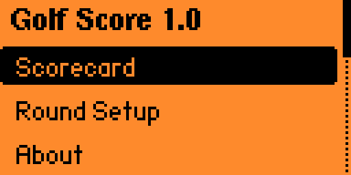
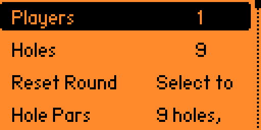
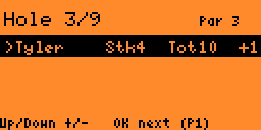

# Golf Scorecard
Keep golf scores for up to four players on the Flipper Zero.

## Features
- Quick score adjustment with the D-pad (Up/Down to change strokes, Left/Right to change holes)
- Track 9 or 18 hole rounds and see totals plus relation to par
- Customize each hole's par from the Round Setup menu
- Save, load, and delete favorite course presets for quick setup
- Rename players and reset rounds from the Round Setup menu
- Clean GolfScore code structure (`app.cpp`, `scorecard/scorecard.cpp`, `settings/settings.cpp`)

## Usage
1. Open the app and choose **Round Setup**.
   - **Players** cycles between 1‑4 golfers.
   - **Holes** toggles 9 or 18 hole rounds.
   - **Reset Round** clears every recorded stroke.
   - **Hole Pars** opens the par editor. Use the `Hole` item to pick a hole, then adjust the `Par` item with Up/Down. Press **Back** to return.
   - **Load Course** quickly applies a saved course preset (pars and hole count). Loading a course resets all player scores.
   - **Save Course** stores the current hole count and pars into a favorite slot; pick a slot, enter a name, and confirm.
   - **Delete Course** clears a saved preset slot.
   - **Save Round** appends the current results to the round history log (each player, every hole).
   - **View History** shows previously saved rounds; **Clear History** wipes the log.
   - Select a player name entry to rename that golfer (on-device keyboard or UART, depending on firmware).
2. Choose **Scorecard** to track play:
   - Up/Down change strokes for the highlighted golfer on the current hole.
   - Left/Right move between holes.
   - **OK** switches to the next golfer; long-press **OK** clears that player’s score for the current hole.
   - Press **Back** once every player has a score on every hole to finish the round, save it to history, and view a summary.
3. The scorecard line shows `Name  Stk#  Tot##  +/-`:
   - `Stk` displays strokes on the current hole (or `--` if none yet).
   - `Tot` is the total strokes across all played holes.
   - The final column is relation to par (`E`, `+`/`-`, or `--` if no holes played).

## Screenshots

## Notes
- Scores and player names are stored under `/ext/apps_data/golf_score/data/state.bin`.
- Saved round history is appended to `/ext/apps_data/golf_score/data/rounds.csv` in CSV format as `Date,Time,Course,HoleCount,Player,Total,Relative,H1..H18` (one row per player).
- Customise the launcher icon by editing `app.png` (10×10, monochrome).
